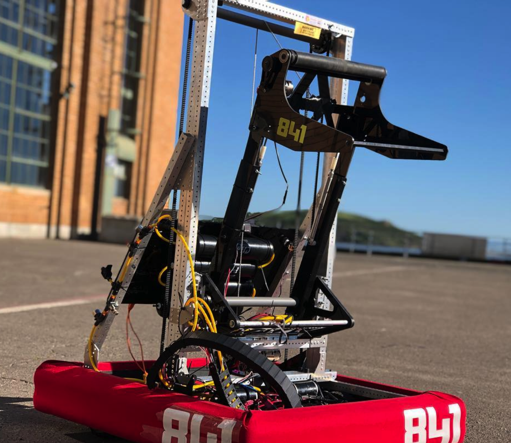

FRC-2019
===========

Code for the robot for the Deep Space FIRST Robotics Competition.
It implements an autonomous mode, automatic camera detection of the objective and all the code needed to operate the different parts of our robot.

TEAM 841.
